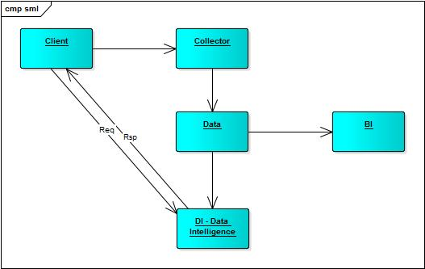

# 结构

# 组件

- 负载均衡层，haproxy，提供限流/限入等安全功能
- 信息收集器，logstash？考虑性能的问题
  - 信息收集采用接口方式，便于接入各种第三方系统
- 入库解析，直接保存到mongodb？
  - mongodb的分布式部署支持PB级别数据，且部署简单
  - mongodb的读写性能优越
  - mongodb和spark都是内存大户？
  - 是否有比bson性能更好的数据格式？
- BI层，spark sql + spagoBI ? zeppelin ?
  - 常规的商业智能团队，采用 统计 + 平台实施 的人才组合模式
  - zeppelin？输入SQL，生成报表？
  - spagoBI，成熟的BI产品？http://www.spagobi.org/homepage/services/documentation/
- DI层，提供模型查询接口
  - REST API
  - 服务层，提供预测结果的调用（需要考虑访问的性能）
    - 模型AB测试支持
  - 核心数据存储层（保存模型/请求上下文/其他？）
    - 第三方系统支持数据的拉取？导入更多的数据？
    - 支持对计算结果的可视化查看，分析，调优？
  - 离线计算层，负责核心数据的持续运算（对性能敏感，需要较多的服务器资源？）
    - 模型的评估
    - 模型的持续演进