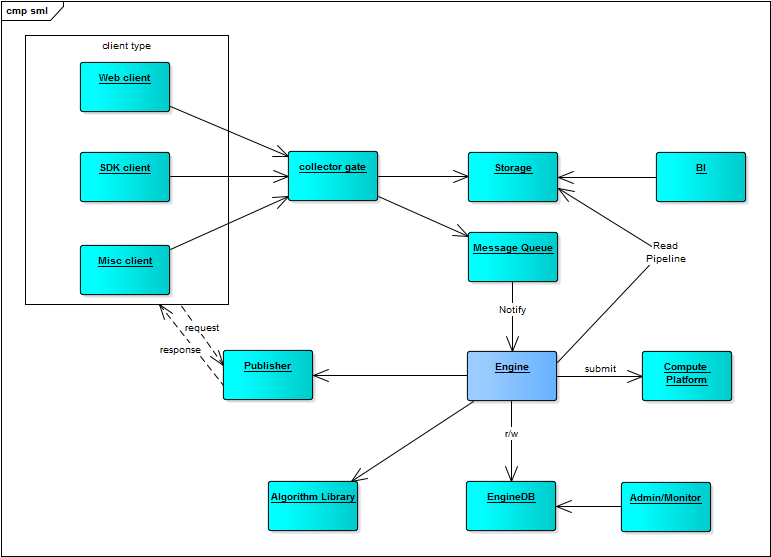

# 系统

# 模块

- 负载均衡层，haproxy，提供限流/限入等安全功能
- 信息收集器，logstash？考虑性能的问题
  - 信息收集采用接口方式，便于接入各种第三方系统
  - 考虑为不同的语言和平台，提供SDK
  - http://chenlinux.com/2014/10/18/performance-testing-tunning-for-logstash-inputs-syslog/
- 入库解析，直接保存到hbase？
  - hbase的分布式部署支持PB级别数据，且部署简单
  - hbase的读写性能优越，且支持数据/文档/图像三种常见的文件格式
  - hbase的二级索引支持：lily，为文本处理增加了极大的可能性
- BI层，(kylin)/(hbase phoenix) + spagoBI ?
  - 常规的商业智能团队，采用 统计 + 平台实施 的人才组合模式
  - spagoBI，成熟的BI产品？http://www.spagobi.org/homepage/services/documentation/
- DI层，提供模型查询接口
  - 服务层，提供预测结果的调用（需要考虑访问的性能）
    - REST API，完成对后端接口的调用，Websocket+kafka，实现实时消息交互
    - 模型AB测试支持
  - 核心数据存储层（保存模型/请求上下文/其他？）
    - zeppelin？输入SQL，生成报表？方便统计人员调研？
    - 第三方系统支持数据的拉取？导入更多的数据？
    - 支持对计算结果的可视化查看，分析，调优？
    - 记录评估结果，以便和将来发生的真实情况做对比
  - 离线计算层，负责核心数据的持续运算（对性能敏感，需要较多的服务器资源？）
    - 模型的评估
    - 模型的持续演进

### implementation (*)

- input: logstash, http in, hbase/kafka out, filter support
- storage: hbase, pb level data, log/file, with scale/backup/restore
- bi: spagobi -> hbase with kylin/phoenix
- di: <- TODO

### 项目划分

- pipeline: data reader, writer, formatter for storage (*)
- scratch: sample code for practise
- sml: (*)
  - core, {algorithm-controller, training-dataset, training-workflow, trained-model}
    - controller, manage the algorithm {metric, status, before-done, for-train, for-predict...}
    - dataset, define the strategy of data usage, how many for train, for test, data format verification
    - workflow, how the core works
    - model, if model is trained, save it to storage
  - algorithm {for train, for service-such as: adaboost multiple models}
    - define, interface define of algorithm
    - ...
- publisher: service interface, use spring framework
  - http
  - websocket + kafka
- admin: (*)
  - dashboard implement
  - logic management

# 核心组件

为保持对spark框架的一致性，采用lambda架构，组件支持序列化，
可以在不同的节点间分布式部署。

组件的工作流程为：
- 输入{训练数据，实际结果}
- 持续计算，获得{评估信息}
- 评估信息达到设定指标，输出{模型}
- 输入{数据}，根据{模型}，获得{预测结果}

在某些情况下，原始的数据根据{查询约束}进行转换，如查询值
的范围，转换为查询类别，此时需要{查询约束}作为上下文

### 算法控制器

算法控制器由{数据，模型，查询约束，预测结果}组成，支持：
- 通过训练，获得模型
- 通过迭代计算，获得预测结果
- 通过多个迭代计算，获得多个预测结果
- 持久化计算结果

### 数据源

考虑数据源对计算的支持，如果是大规模计算，需要内存和磁盘交换，
或无法连续计算，都需要数据源的支持。

数据源包含{训练数据，评估信息，查询约束，实际结果}，支持：
- 读取预训练数据
- 读取训练进度情况（评估信息）

### 算法引擎

算法引擎负责调度，包含{评估信息，查询约束，预测结果，实际结果}，
引擎的作用在于统一化调度接口，支持：
- 训练，输出模型
- 评估，输出评估信息
- 批量评估，输出批量评估信息

### 计算服务

用户的计算需求，与底层的实际运作，会存在一定的区别，如：
请求的计算，可以由多个模型的计算结果组合而成（如按权重组合），
计算服务定义用户的计算请求接口：
- 增补，对查询请求进行修订
- 服务，根据底层的引擎调度结果，完成最终输出

### 数据预处理管道

考虑到数据进入格式的多样化，以及不同计算模型对数据格式的要求
存在差异，以及结果输出时，对数据格式有不同的要求，应当提供
数据预处理管道，满足各种场景。

### 控制组件：引擎

实现类，对算法引擎的实现，核心是训练和评估
- 训练：计算获取模型，并保存
- 部署准备：把{算法，参数，模型}组合并准备持久化
- 模型持久化：考虑模型有单机和多机两种情况，保存的策略不一样（单机训练，多机部署/多机训练，单机部署）
- 评估：调用引擎的评估计算，返回结果，结果可用于保存，方便评估

### 控制组件：评估

评估包含引擎和评估量度(metric)，继承自deployment(deployment extends EngineFactory)

### 量度 Metric

对结果进行评估，包括有平均值、方差、汇集、零值等

### 流程参数

- 标识，记录每一次运行的识别符
- 详细度，设定每一次运行的输出详细度
- 保存，是否保存该次运行的训练模型
- 数据可用性检查，是否对数据的可用性进行检查
- 进度控制，可以设定运行的进度，不需要把整个流程跑完

### 辅助类

包括数据的读入、初始化、格式转换等等功能

### 服务插件

定义引擎的插件接口，可以从持久化介质装载到运行态

### 服务接口热插拔

基于actor系统的服务器实现，可利用actor的可更新功能，实现插件的热插拔
