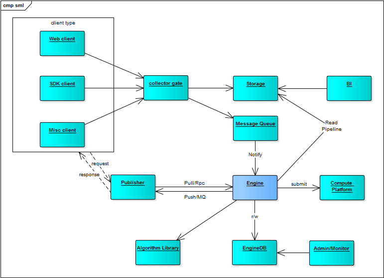

# 系统

## 模块

- 接入负载均衡层，提供负载均衡、限流/限入等安全功能
- 信息收集器，考虑采集格式的问题
  - 信息收集采用接口方式，便于接入各种第三方系统
  - 考虑为不同的语言和平台，提供SDK
- 入库存储，直接保存到mongodb/hbase/hadoop/kafka/mysql/postgres？
  - redis/mongodb/...
    - TB级数据支持，且部署简单
    - 提供schemaless data/document的支持
    - 丰富的接口支持，接入hadoop生态
  - hbase (scan support?)
    - hbase的分布式部署支持PB级别数据
    - hbase的读写性能优越，且支持数据/文档/图像三种常见的文件格式
    - hbase的二级索引支持：lily，为文本处理增加了极大的可能性
- 后台部分
  - 后台管理配置工具：系统组件管理、数据生产配置、生产插件管理、任务调度配置、数据资产管理、数据服务
  - 面向数据应用的工具
  - 第三方自助式服务，如BI应用，如探索性应用，metabase/zeppelin
    - 接入各种现成的BI系统，适应常规的商业智能团队，采用 统计分析 + 平台实施 的团队组合模式
    - metabase 通过配置sql实现数据报表，支持配置到可视化展示页面
    - zeppelin 通过语言开发实现数据分析，支持配置到可视化展示页面，可结合插件开发使用（自定义udf）

## 周边

### 打包/安装/升级工具
### 后台工具
管理工具增强
### 配置
### 文档
### 模板&案例
采用模板方式，组织在平台上的各种功能
### 测试工具
服务压测、评估、监控等

