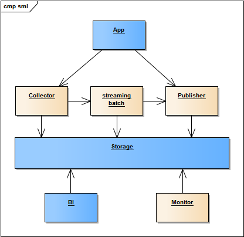

## 系统

## 模块

- 负载均衡层，haproxy，提供负载均衡、限流/限入等安全功能
- 信息收集器，考虑采集格式的问题
  - 信息收集采用接口方式，便于接入各种第三方系统
  - 考虑为不同的语言和平台，提供SDK
- 入库存储，直接保存到mongodb/hbase/hadoop？
  - mongodb
    - TB级数据支持，且部署简单
    - 提供schemaless data/document/image的支持
    - 丰富的接口支持，接入hadoop生态
  - hbase (scan support?)
    - hbase的分布式部署支持PB级别数据
    - hbase的读写性能优越，且支持数据/文档/图像三种常见的文件格式
    - hbase的二级索引支持：lily，为文本处理增加了极大的可能性
- BI层，spark sql/hbase phoenix + zepplin/saiku ?
  - 接入各种现成的BI系统，适应常规的商业智能团队，采用 统计分析 + 平台实施 的团队组合模式
  - saiku 成熟的BI产品？http://www.spagobi.org/homepage/services/documentation/
- DI层，提供模型查询接口
  - 服务层，提供预测结果的调用（需要考虑访问的性能）
    - REST API，完成对后端接口的调用，实现实时消息交互
    - 模型AB测试支持，记录多个版本引擎的查询结果，并对比分析
  - 核心数据存储层（保存模型/请求上下文/其他？）
    - 权限控制？数据获取规模控制？
    - 自开发后台？输入SQL，生成报表？方便统计人员调研？
    - 第三方系统支持数据的拉取？导入更多的数据？
    - 支持对计算结果的可视化查看，分析，调优？
    - 记录评估结果，以便和将来发生的真实情况做对比
  - 离线计算层，负责核心数据的持续运算（对性能敏感，需要较多的服务器资源？）
    - 模型的评估
    - 模型的持续演进

### modules

- spring-test: a demo app to show how to integrate sml with application
- sml: (*)
  - core, {algorithm-controller, training-dataset, training-workflow, trained-model}
    - controller, manage the algorithm {metric, status, before-done, for-train, for-predict...}
    - dataset, define the strategy of data usage, how many for train, for test, data format verification
    - workflow, how the core works
    - model, if model is trained, save it to storage
  - algorithm {for train, for service-such as: adaboost multiple models}
    - define, interface define of algorithm
    - ...
- pipeline: data streaming (*)
- scratch: algorithm code for batch/stream-compute
- publisher: service hook, DSL for configuration
- monitor: (*)
  - dashboard implement
  - admin management

### implementation (*)

- input: flume, http in/springboot, streaming out, filter support
- storage: mongodb light solution/hbase, pb level data
- bi: zepplin -> spark
- di: <- TODO

## 周边

### 打包工具
### 命令行工具
对服务的使用进行支持
### 后台工具
管理工具增强
### 配置
### 文档
### 模板&案例
采用模板方式，组织在平台上的各种功能
### 测试工具
服务压测、评估、监控等

