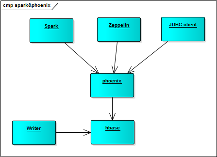

# Spark

Spark是整个框架里面的核心组件，负责：
- 对产生的消息进行流式处理，持续计算预测模型
- 当smlbatch请求计算结果时，完成计算并返回结果
- 必要时，为第三方bi工具提供ad-hoc

现版本用mongodb作为底层存储，方便开发和调试，应对中小规模的应用

## Spark Architecture

https://databricks.com/blog/2015/01/09/spark-sql-data-sources-api-unified-data-access-for-the-spark-platform.html

https://mapr.com/developercentral/code/loading-hbase-tables-spark/

https://stackoverflow.com/questions/33644551/hbase-using-spark-sql

https://stackoverflow.com/questions/27108863/accessing-spark-sql-rdd-tables-through-the-thrift-server

https://stackoverflow.com/questions/29840502/accessing-spark-rdds-from-a-web-browser-via-thrift-server-java

在hbase建立了index后，可以考虑把index作为RDD引入(solr4j)

## Spark with Phoenix

如果底层转换为HBase做存储，可以考虑把phoenix作为bi层的对外接口，不用把什么都丢给spark处理
phoenix提供二次索引，JDBC接口，以及针对spark分布式查询的优化连接器，大幅度提升处理效率
