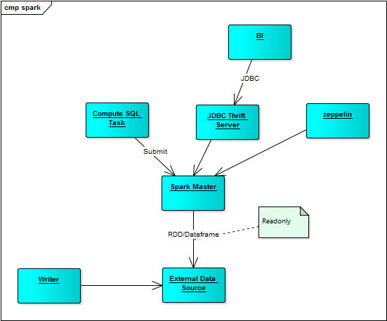

# Spark Architecture

https://databricks.com/blog/2015/01/09/spark-sql-data-sources-api-unified-data-access-for-the-spark-platform.html

https://mapr.com/developercentral/code/loading-hbase-tables-spark/

https://stackoverflow.com/questions/33644551/hbase-using-spark-sql

https://stackoverflow.com/questions/27108863/accessing-spark-sql-rdd-tables-through-the-thrift-server

https://stackoverflow.com/questions/29840502/accessing-spark-rdds-from-a-web-browser-via-thrift-server-java

在hbase建立了index后，可以考虑把index作为RDD引入(solr4j)